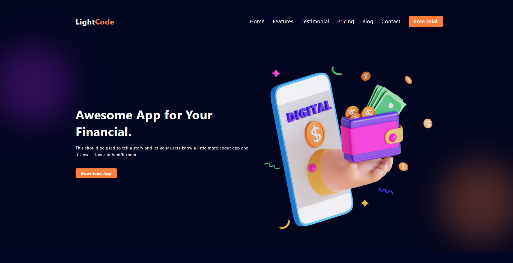

# 💸 LightCode – Responsive Banking Website Landing <span style="text-center">Page</span>

<div align="center">
  
  <br />

  
  
  
</div>

<br/>

## 📝 Overview

**LightCode** is a modern and responsive landing page for a digital banking or finance app. Built using **Tailwind CSS v4**, **HTML5**, and **Vanilla JavaScript**, it features interactive animations (powered by AOS), testimonial carousel, responsive navigation, and multiple custom sections like features, pricing, blog, contact, and more.

---

## 📍 Live Demo

👉 [Click here to view the live demo](https://karthickramalagar.github.io/LightCode/)
📁 [View the GitHub Repository](https://github.com/karthickramalagar/LightCode)

---

## 📚 Table of Contents

1. [Features](#features)
2. [Tech Stack](#tech-stack)
3. [Screenshots](#screenshots)
4. [Installation](#installation)
5. [Usage](#usage)
6. [License](#license)
7. [Acknowledgements](#acknowledgements)

---

## ✨ Features

✅ Fully responsive layout
✅ Mobile-friendly hamburger menu
✅ Animated sections using AOS
✅ Hero section with CTA
✅ Feature cards with hover effects
✅ Finance information + infographic
✅ How It Works step flow
✅ Testimonial section with interactive images
✅ Reusable Tailwind utility classes
✅ Clean and organized code structure

---

## 🛠 Tech Stack

* **HTML5** – Markup structure
* **Tailwind CSS v4** – Utility-first styling
* **JavaScript (Vanilla)** – Interactive features
* **AOS** – Animate On Scroll library for scroll-based animations
* **Font Awesome** – Icon library

---

## 📸 Screenshots

> Replace these with actual screenshots from your `images/` folder

```html
<!-- Example usage -->

```

---

## ⚙️ Installation

### ✅ Prerequisites

* Node.js and npm installed
* Git installed (optional)

### 📦 Clone the Repository

```bash
git clone https://github.com/karthickramalagar/LightCode.git
cd LightCode
```

### 📥 Install Tailwind CSS CLI

```bash
npm install
```

---

## 🚀 Usage

Start Tailwind watcher to compile `input.css` into `output.css`:

```bash
npm start
```

Then open `index.html` in your browser or run a local development server like VS Code Live Server.

---

## 📄 License

This project is licensed under the **MIT License**.
You’re free to use, modify, and distribute for personal or commercial purposes.

---

## 🙏 Acknowledgements

* [Tailwind CSS](https://tailwindcss.com)
* [AOS – Animate On Scroll](https://michalsnik.github.io/aos/)
* [Font Awesome](https://fontawesome.com)
* Design inspired by modern banking UI/UX trends

---

## 👨‍💻 Author

**Made with ❤️ by [KarthickRamAlagar](https://github.com/karthickramalagar)**

[](https://github.com/karthickramalagar)
[](https://www.linkedin.com/in/karthickeyan-ramalagar-763404370/)


---


